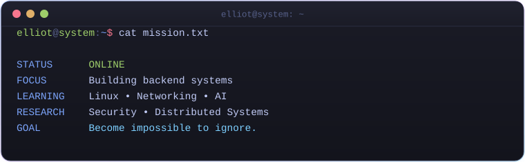
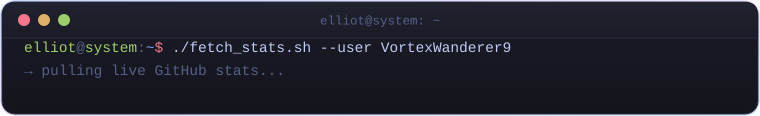
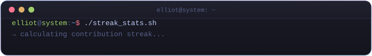
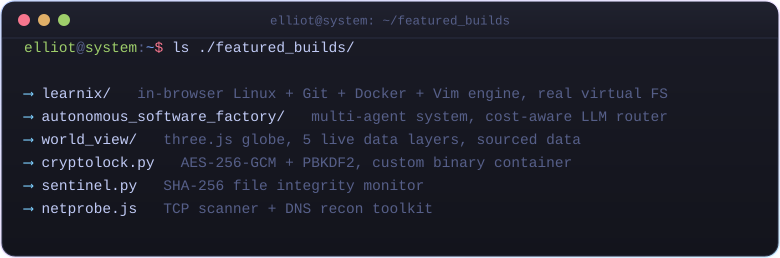
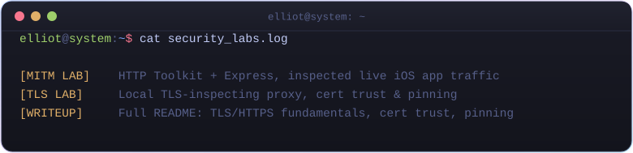
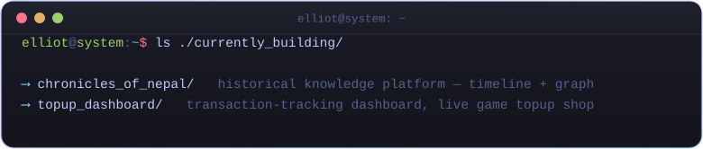
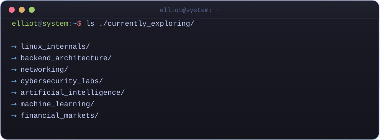
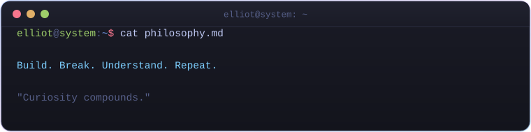
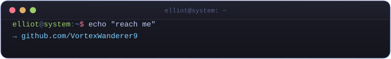

<div align="center">

# ELLIOT
### Systems • Security • Intelligence

```
$ whoami
```

*Learning by building. Understanding by breaking.*

<br>


<br>


<br>

[](https://github.com/VortexWanderer9)


</div>

<br>



<br>



<div align="center">


</div>

<br>



<div align="center">

</div>

<br>



<br>



<br>



<br>



<br>



<br>

<div align="center">



<br>

[](https://github.com/VortexWanderer9)

[](https://git.io/streak-stats)
</div>
